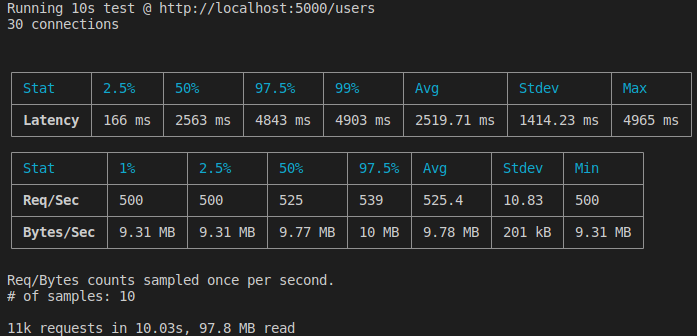

# Python Web Frameworks Benchmark

This project hosts the same application implemented in [CherryPy](https://docs.cherrypy.dev/en/latest/), [FastAPI](https://fastapi.tiangolo.com/) and [Flask](https://flask.palletsprojects.com). Then, we load test each one of then using [autocannon](https://github.com/mcollina/autocannon) and present the results.

## Application
The application contains two endpoints:
- `GET /`: receives no input data and returns `{"Hello": "World"}`
- `POST /users`: receives `{"name":str, "age":integer, "location":str}` and returns the input content concatenated 1024 times

To run each app we use the application server recommended on the framework docs.
On each `run.sh` file I also added a commented line with the command to run the app with [Gunicorn](https://gunicorn.org/) (production WSGI server) with 4 sync workers for CherryPy and Flask and 4 UvicornWorker's for FastAPI. 

## Running the apps
- Clone the repository
- Run `docker compose up` on the root directory

The applications will be listening on the ports:
| Application | Port |
| ----------- | ---- |
| flask       | 5000 |
| fastapi     | 8000 |
| cherrypy    | 8080 |

## Running the tests
- Install [autocannon](https://github.com/mcollina/autocannon)
- Run `./test.sh --post` or `./test.sh --get` depending on which endpoint you wants to load test
The tests runs for 10 seconds with 30 simultaneous connections for each app.
---
## Test example
> Linux Mint 20 on Ryzen 5 5400G,  32GB of RAM

### GET endpoint
#### Flask

#### FastAPI

#### CherryPy

### POST endpoint
#### Flask

#### FastAPI

#### CherryPy
